# 自动化测试框架使用说明（UI版）
## 一、功能介绍
### 系统管理
可管理被测系统

### 接口管理
可管理被测接口

### 用例管理


1. 可根据需要增、删、改、查指定表（X）
2. 可组装请求参数
3. 可发送HTTP请求（后期需要支持dubbo）
4. 可获取接口返回结果，对结果进行校验（X）
5. 可直接查询指定数据库表，做数据校验（X）
6. 可复制用例并对其进行修改
7. 单条用例执行
8. 批量执行用例


### 数据统计
1. 统计批量执行总用例数
2. 总成功数
3. 总失败数


## 二、框架使用

### 1、工程目录介绍

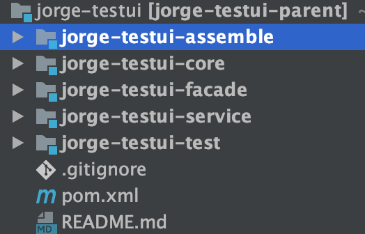

#### assemble
>该目录下存放系统启动配置文件，以及使用main启动工程

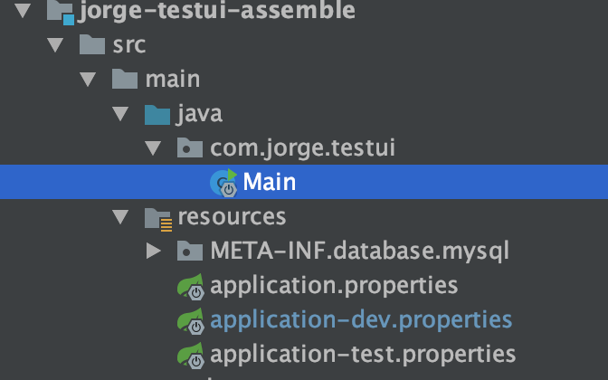

**测试工程的数据库、dubbo、redis及其它相关配置都在该文件里进行修改**
#### core
>该目录下存放该系统的所有核心功能，以及所需要调用的系统的dao、entity、service

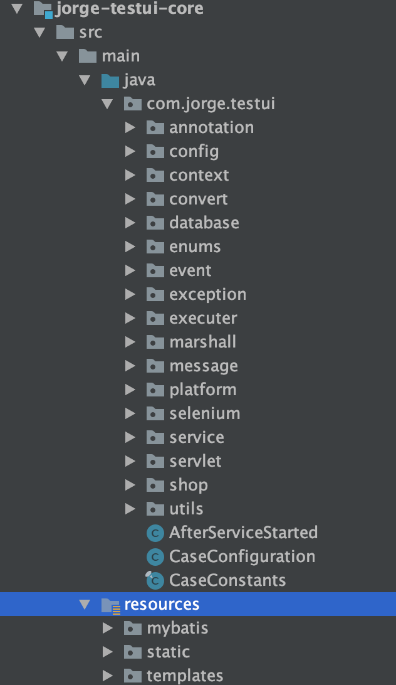

- database目录存放各个系统的dao、entity、service类，可在此目录下编写操作数据库的方法
- platform目录存放的系统核心表的dao、entity、service类，及Boss页面相关功能
- 其它包下存放的为框架核心处理逻辑，可暂不关心，如果需要进行二次开发可仔细查看源码

#### facade
该目录在测试工程中暂未使用

#### service
>该目录存放所有的测试用例

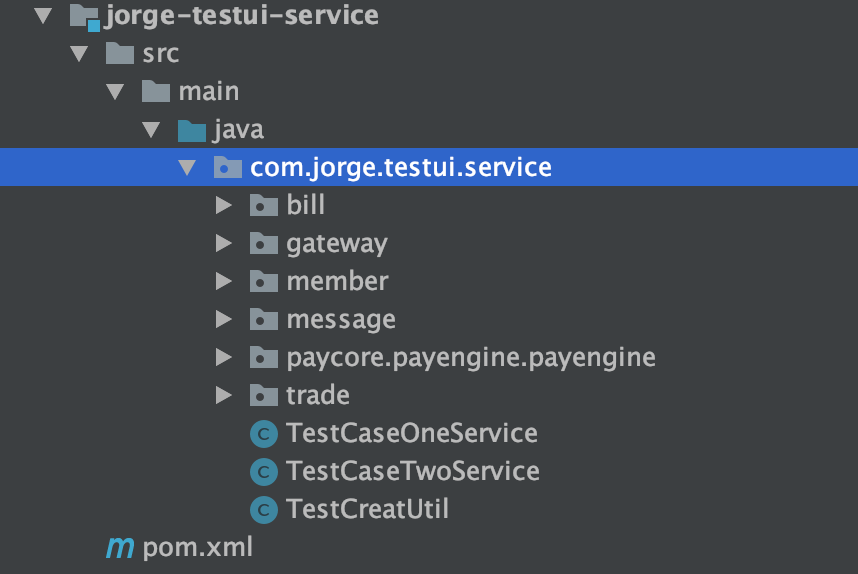

- message目录存放所有用例的请求参数对象
- 其它目录存入各个子系统的用例执行代码

#### test
>单元测试目录


### 2、编写一条测试用例
#### 1.编辑配置文件
进入assemble目录下的resources,打开application.properties文件，编辑相关参数。

```
#测试对应该系统的数据库地址及库名
acooly.ds.url=jdbc:mysql://192.168.55.32:3306/hunjiaclass_test
#数据库用户名
acooly.ds.username=root
#数据库密码
acooly.ds.password=123456
#是否启用jpa功能
acooly.jpa.enable=true
#数据源前缀
acooly.mybatis.multi.acooly.dsPrefix=acooly.ds
# dao包路径，位于此包下的dao会使用accout数据库
acooly.mybatis.multi.acooly.scanPackage=com.autotest.hjc
# 配置为主数据库，多个数据源时只能配置一个主数据库
acooly.mybatis.multi.acooly.primary=true
```

如果我们的被测对象对单系统，那我们只需要配置一个数据库连接即可，但是在我们的测试过程中很多情况会遇到soa的系统，那么我们就需要连接多个数据库，对应多个系统，我们只需要在配置文件中启用多数据源功能，并配置相应的数据源即可。

```
#启用多数据源支持
acooly.mybatis.supportMultiDataSource=true
#此数据库作为记录测试用例执行结果使用，提供后台查看结果
mock.ds.url=jdbc:mysql://192.168.55.32:3306/mock_test
mock.ds.username=root
mock.ds.password=123456
#配置mock
acooly.mybatis.multi.mock.dsPrefix=mock.ds
acooly.mybatis.multi.mock.scanPackage=com.autotest.mock
```

以上配置为我多加了一个mock系统的数据源配置，如果有更多的系统就按照以上方式进行配置即可。
在soa的系统中我们可能会进行facade的接口测试，那么我们就需要对dubbo进行配置。

```
#服务拥有者
acooly.dubbo.owner=mufanglin
#zk的注册地址
acooly.dubbo.zkUrl=192.168.55.36:2181
#服务注册端口
acooly.dubbo.provider.port=2183
acooly.dubbo.provider.register=true
```
在一场景中我们可能还会使用到缓存，那么我们就需要进行redis的配置。

```
#redis地址
spring.redis.host=192.168.55.36
#redis端口
spring.redis.port=6379
```

#### 2.实体生成
- 进入test目录下的resources，打开application.properties文件，编辑相关参数


```
#要生成dao、实体类的数据源
jdbc.url=jdbc:mysql://localhost:3306/hunjiaclass?useUnicode=true&amp;characterEncoding=UTF-8
jdbc.username=root
jdbc.password=12345678
```
**其它的配置在该文件中都有注释，可自行查看。**
- 打开AcoolyCoder类，对其需要生成的实体类的目录进行指定，以及指定那些表需要生成实体类。


```
#该方法中的参数如果为*时就表示生成所有表，如果要生成多个表用逗号分隔"table_a","table_b"
service.generateTable("b_member_relation");

#此方法中对其生成的实体类进行包路径的指定，此处对应了数据源的包扫描路径
private static String getRootPackage() {
		return "com.autotest.hjc";
	}
```

配置完成后直接运行该类中的main函数即可生成dao、实体类，到指定的目录下。
**注意：使用此方法进行实体生成时会将之前生成的文件全部覆盖，所以生成时一定要十分小心，建议将其指定生成到temp包路径下，然后再将其复制到对应的包下**

#### 3.编写dao的查询

在我们的测试用例中可能使用到一些查询数据的方法，在这里我们可以直接在之前生成的dao中编写我们的查询方法。

```
public interface ApiAuthDao extends EntityMybatisDao<ApiAuth> {
	
	@Delete("delete from api_auth where access_key = #{accessKey}")
	void deleteApiAuthByAccessKey(@Param("accessKey") String accessKey);
	
	@Select("select * from api_auth where access_key = #{accessKey}")
	ApiAuth findApiAuthByAccessKey(@Param("accessKey") String accessKey);
	
}
```

#### 4.编写测试用例

##### 1）新建测试类

在jorge-testui-service模块下新建一个类继承BaseCaseService类，用例的类名格式：service名+测试方法名+TestService，并重写doService方法，在类上加上@CaseApiService注解。

```
@Slf4j
@CaseApiService(caseNo = "testCaseOne", desc = "测试用例", owner = "mfl")
public class TestCaseOneService extends BaseCaseService<TestCaseOneApiRequest, TestCaseOneApiResponse> {

    @Override
    protected void doService(TestCaseOneApiRequest request, TestCaseOneApiResponse response) {
        
    }

}
```
**在注解中加上caseNo为该测试用例服务的唯一标识，不能重复，一般取被测对象的service名+测试方法名**

##### 2）新建请求参数对象类

在jorge-testui-service模块的messge包路径下新建一个request请求类继承ApiRequest（**被测对象为OPENAPI服务时**）或者FacadeRequest（**被测对象为FACADE接口时**）类。

```
@Getter
@Setter
public class TestCaseOneApiRequest extends ApiRequest {

}
```

在测试类中使用该request类。

##### 3）定义请求参数
在确定了我们的被测试对象后，需要在rquest类中去定义该接口所需要的请求参数。

```
@Getter
@Setter
public class TestCaseOneApiRequest extends ApiRequest {
        private String userNo;
        private String amount = "0";
        private Long age;
        private Integer sex;
        private TestCaseOneRequestInfo requestInfo = new TestCaseOneRequestInfo();
        private Interface interfaces = new Interface();
        private List<TestCaseOneRequestInfo> requestInfos = Lists.newArrayList();
}
```
在请求参数我们可以定义基本数据类型，以及复杂对象类型，在定义对象时需要默认new一个对象，目的是为生成参数模板时使用。例如我们需要向数据库中插入一个条会员信息，那么我们只需要在request类中定义一个我们的实体User对象类，就可以方便我们在编写测试用例代码时快速插入一条数据。

##### 4）编写测试用例代码

回到我们新建的测试用例类下，编写我们的测试用例代码，在代码中我们一般包含了以下几个步骤：

- 清除数据：在进行测试前先将垃圾数据清除掉。
- 准备数据：完成垃圾数据的清理后再准备我们所需要的前置数据，例如我们所需要的会员账号等。
- 测试过程：准备调用我们被测对象所需要的参数
- 调用接口：向我们的被测对象发送请求（可能是dubbo服务，也可能是API接口）
- 结果验证：验证我们被测对象的返回数据是否与我们的期望值一致
- 数据验证：验证数据库的值是否与我们期望的一致
- 清除数据：完成测试后将我们该条用例产生的数据，防止数据干扰（**在这里我们尽量指定唯一条件进行删除，防止用例间的干扰**）


```
@Slf4j
@CaseApiService(caseNo = "AliZhuScanPayApiServiceTestSuccess", desc = "支付宝主扫", owner = "mufanglin")
public class AliZhuScanPayApiServiceTestSuccessService	extends
														BaseCaseService<AliZhuScanPayApiServiceTestSuccessApiRequest, CaseBaseResponse> {
	
	@Override
	protected void doService(	AliZhuScanPayApiServiceTestSuccessApiRequest request,
								CaseBaseResponse response) {
		JSONObject responseEntity = new JSONObject();
		String securityKey = request.getSecurityKey();
		String accessKey = request.getAccessKey();
		String partnerId = request.getPartnerId();
		//清除数据
		
		//准备数据
		request.setRequestNo(Ids.getDid(20));
        JSONObject jsonObject = TestCreatUtil.createTrade("19092311100076110018", "", "", "", "",
                request.getGatewayUrl(), partnerId, securityKey, partnerId);
        request.setMerchOrderNo(jsonObject.getString("merchOrderNo"));
		
		//测试过程
		Map<String, Object> map = new HashMap<String, Object>();
		HttpUtil.buildMap(request.getNotifyUrl(), request.getReturnUrl(), request.getRequestNo(),
			request.getService(), partnerId, request.getSingType(), request.getVersion(),
			request.getContext(), request.getMerchOrderNo(), map);
        map.put("productInfo",request.getProductInfo());
        map.put("deviceType",request.getDeviceType());
        map.put("userIp",request.getUserIp());
        map.put("macAddress",request.getMacAddress());
		map.put("payLimit;", request.getPayLimit());

		//调用接口
		responseEntity = HttpUtil.httpRequest(request.getGatewayUrl(), map, securityKey, accessKey);
		response.setContext(JSONObject.toJSONString(map));
		response.setApiResponse(JSONObject.toJSONString(responseEntity));
		
		//结果验证
		AssertsUtil.assertThan(request.getResultCode(), responseEntity.get("code"));
		AssertsUtil.assertThan(request.getMessage(), responseEntity.get("detail"));
		
		//数据验证

		//清除数据
    
    //响应结果组装
		response.setCaseNo(request.getCaseNo());
		response.setSuccess(true);
		response.setGatewayUrl(request.getGatewayUrl());
		
	}
	
}
```
当我们需要对某个实体进行操作时，需要注入DAO

```
@Resource
TradetraTradeDao tradetraTradeDao;
```

如果我们测试的对象为facade时我们需要对其接口进行引入

```
@Reference(version = "1.0")
SignFacade signFacade;
```

##### 5）快速生成测试类

可以使用在test模块下的com.jorge.testui.test.FreemarkerDemo类快速生成测试代码。
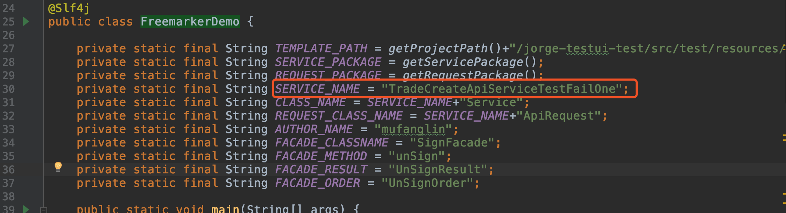

- 将service_name改为自己所需要的caseNo名称

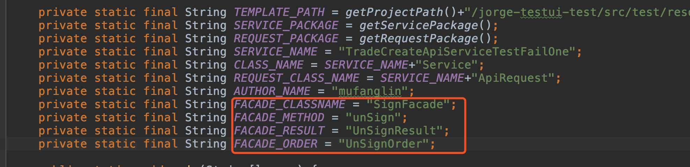

- 如里被测试对象为Facade接口则将此四个参数改为对应的接口类名、接口方法名、接口返回类名、接口请求order类名。

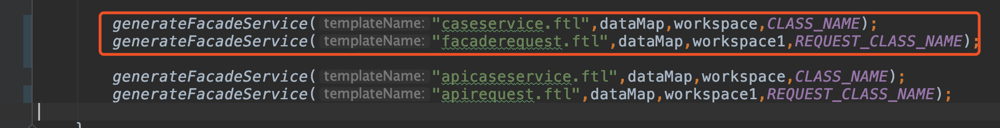

- 如果被对象为Facade接口，则使用此模板生成类，如果被测对象为API接口，则使用下面模板生成类。（**请将不需要生成的模板注释掉**）

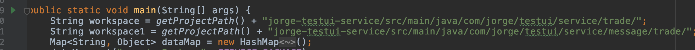

- workspace为测试类存放路径，workspace1为rquest类存放路径（**生成代码时注意修改路径**）

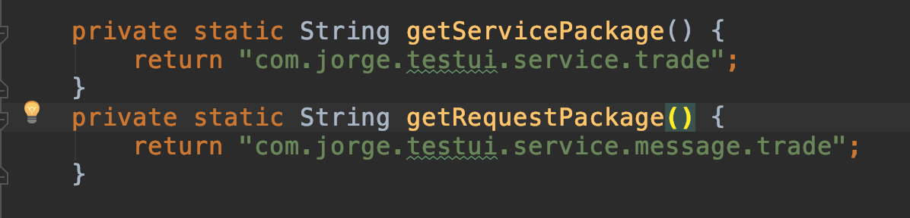

- getServicePackage为测试类的包路径，getRequestPackage为request类的包路径（**生成代码时注意修改**）

#### 5.启动工程
进入assemble目录下的Main，修改环境变量为我们所需要的名称，运行main就OK了。
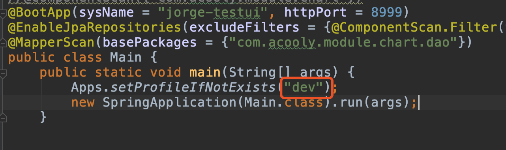

#### 6.添加用例
##### 1）添加系统
启动完成后，打开[自动化测试框架(UI版)BOSS后台](http://127.0.0.1:8999/manage/index.html)，进入测试管理的测试项目管理菜单，点击添加按钮。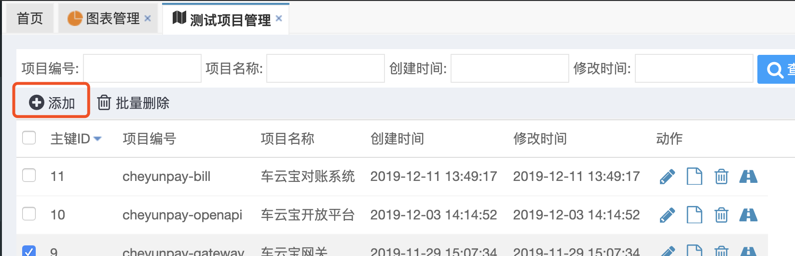
输入项目信息，点击新增按钮进行保存。
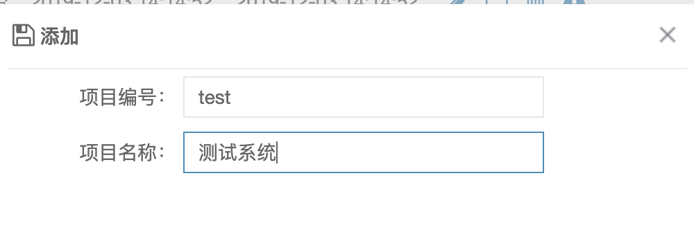

##### 2）添加接口
添加完成系统后，选中刚才所添加的系统，在下方菜单中点击添加按钮，进行接口的添加。
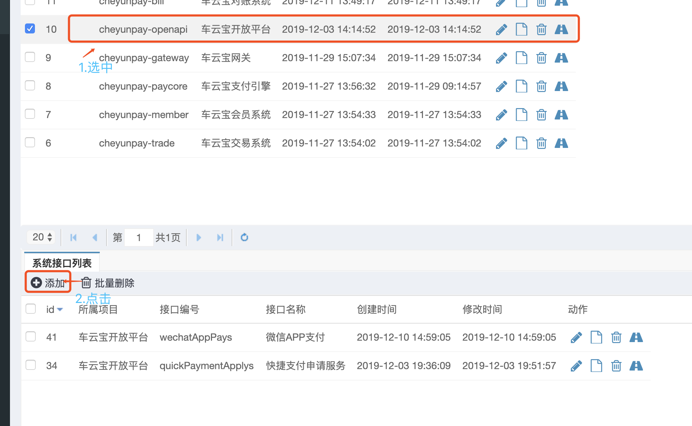
输入接口编号和接口名称，点击增加按钮进行保存。
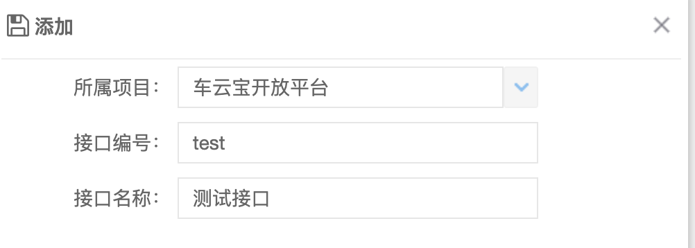

##### 3）添加用例
添加完成接口后，选择用例管理菜单，点击添加按钮。
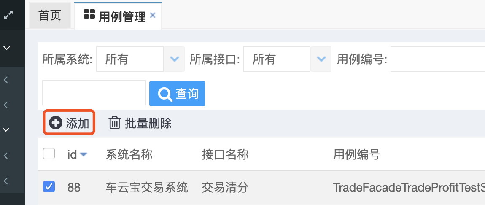
输入用例信息，点击新增按钮进行保存。
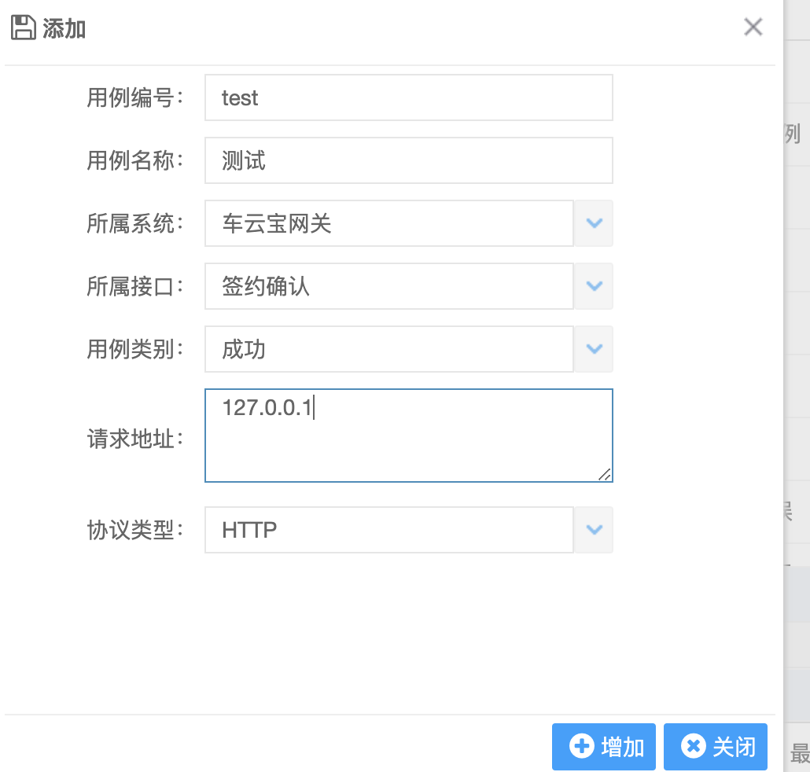
- 用例编号填写@CaseApiService注解中的caseNo。
- 用例名称处定义
- 所属系统和接口选择我们刚才所添加信息
- 如果被测对象为openapi时则填写其服务请求地址，如果为facade则输入任意值即可
- 其它选项任意填写，暂未做任何使用和校验

##### 4）添加请求参数
添加完成用例后，选中刚才添加用例，在下方菜单中点击添加按钮，进行请求参数的添加。
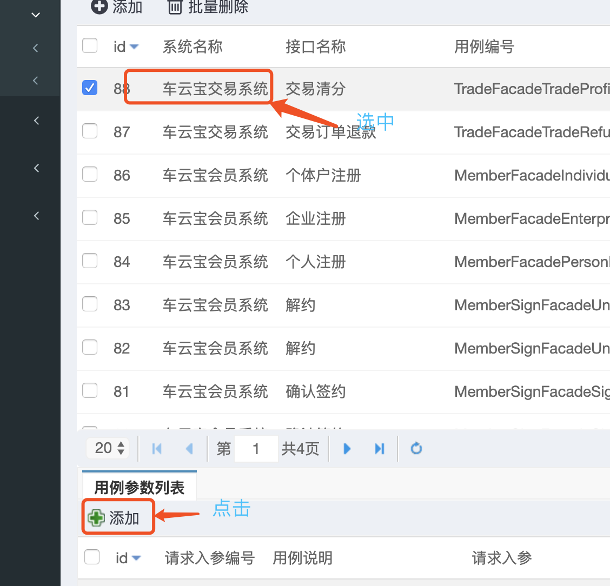
在编辑页面中编辑请求参数信息，点击新增按钮进行保存。
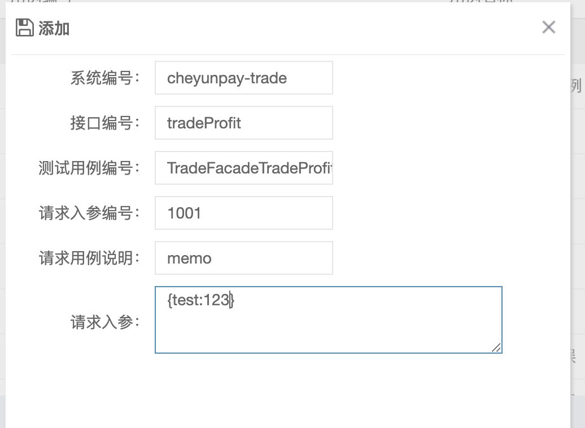
**在这里的请求入参可在请求参数模板菜单中进行拷贝，在应用启动时会生成相应用例的请求参数模板，只需要将其拷出填入我们所需要的参数值即可。**

##### 5）用例执行
在BOSS后台可进行按系统、按接口、按用例、按请求参数进行用例的执行，在每个列表最后有一个执行按钮，点击便可执行对应的用例。
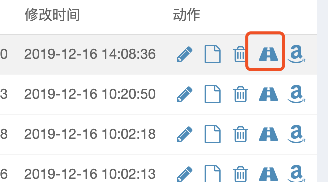

##### 6）复制用例
可以在用例管理的用例列表和参数列表进行用例的复制。
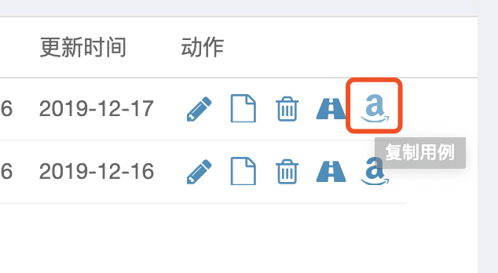

#### 7.其它说明
- 当被测对象为openapi服务时，可以在配置文件中配置统一的请求地址及商户密钥，当jorge.common.configuration.enable=true时就会默认使用统一配置，为false时则继续使用用例管理中的地址及参数中传入的商户信息。
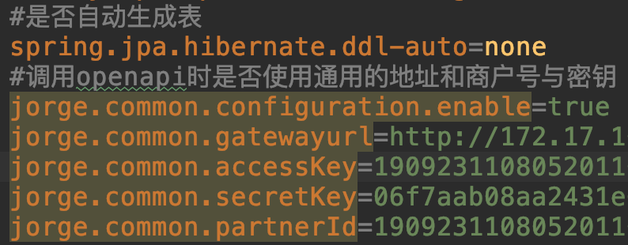

#### 8.批量执行用例
当我们在回归用例时可选择多条用例，进行批量执行
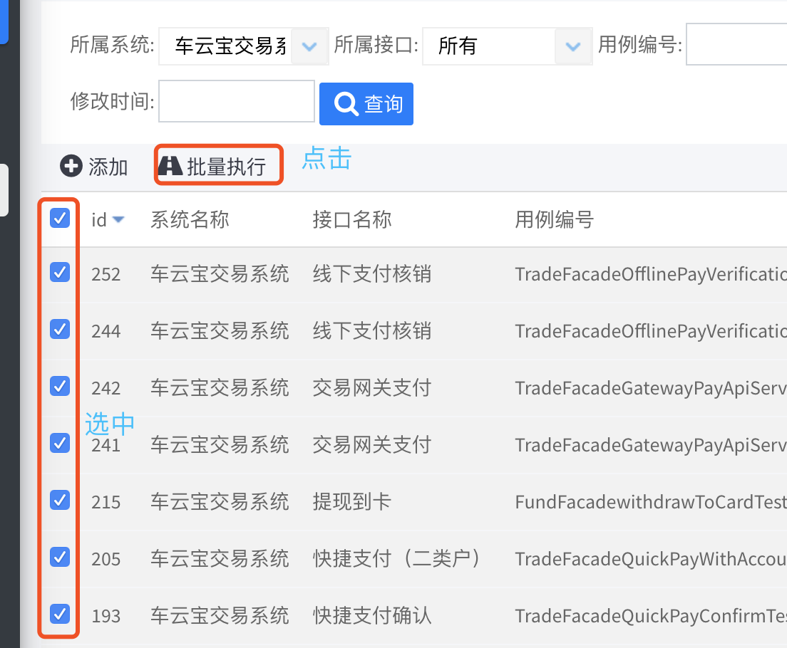

#### 9.批量添加参数
在编写用例过程我们可能需要进行请求参数的添加、修改、删除，如果对每条用例进行编辑是相当慢的，所以做了参数的批量操作功能。

- 选择一条用例，点击批量添加请求参数按钮
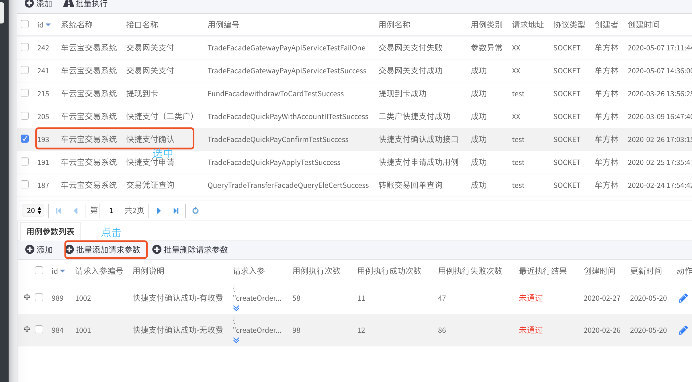
- 此处输入父节点位置，默认为最外层json对象，输入需要添加的参数和值便可。**特别说明：如果输入的参数已经存在，将对其参数值进行覆盖，所以在进行批量添加时一定要清楚参数是否已存在**
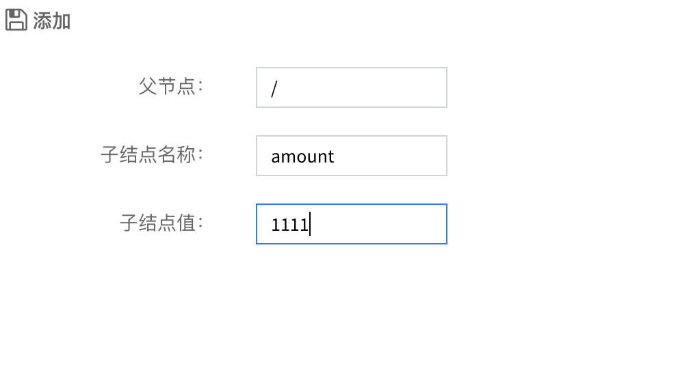
- 同理，可对参数进行批量的删除，删除时只需要输入参数所在结点位置和参数名便可删除
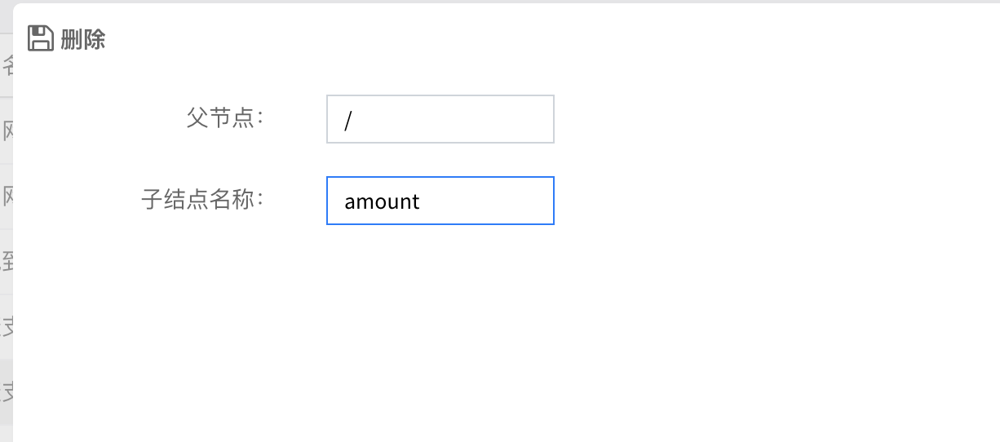

#### 10.首页统计
在首页中增加了用例执行结果统计，可以方便的看出各个系统用例执行情况。
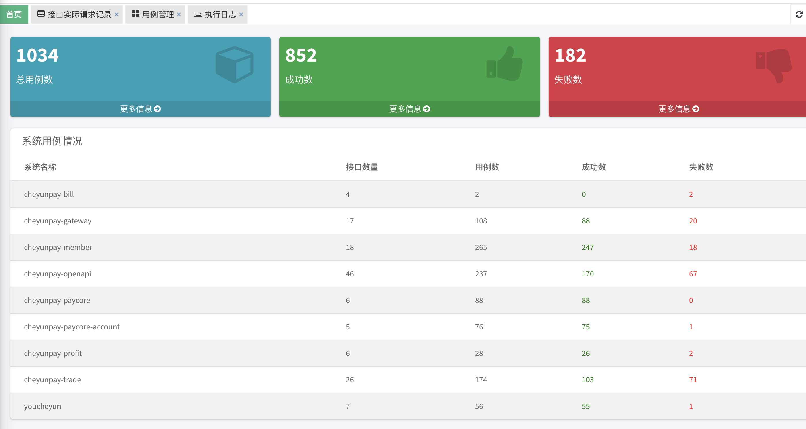

## 三、Mock接口

## 四、后续功能
1. 集成selenium，进行UI自动化测试
2. 集成appium，进行APP自动化测试

